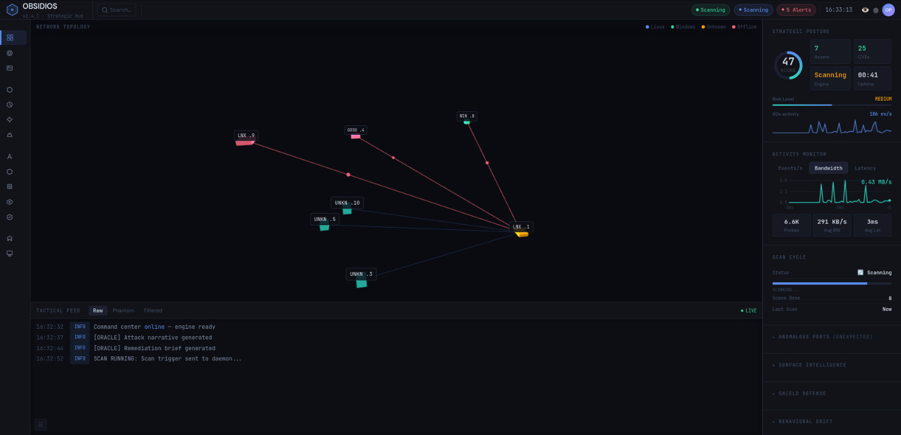
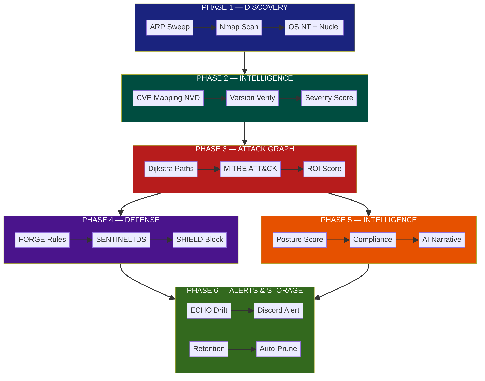

<div align="center">
  <pre>

 █████╗  ██████╗  ██████╗  ██╗ ██████╗  ██╗  █████╗  ██████╗
██╔══██╗ ██╔══██╗ ██╔════╝ ██║ ██╔══██╗ ██║ ██╔══██╗ ██╔════╝
██║  ██║ ██████╔╝ ██████╗  ██║ ██║  ██║ ██║ ██║  ██║ ██████╗
██║  ██║ ██╔══██╗ ╚═══██╗  ██║ ██║  ██║ ██║ ██║  ██║ ╚═══██╗
╚██████╔ ██████╔╝ ██████╔╝ ██║ ██████╔╝ ██║ ╚██████╔╝██████╔╝
 ╚═════╝  ╚═════╝  ╚═════╝  ╚═╝ ╚═════╝  ╚═╝  ╚═════╝  ╚═════╝

  </pre>

  <h1>Autonomous Predictive Network Security Platform</h1>

  <p>
    <strong>Real-time host discovery · AI-driven vulnerability mapping · Attack path simulation · 3D tactical dashboard · Automated defense</strong>
  </p>

  <p>
    <a href="#"></a>
    <a href="#"></a>
    <a href="#"></a>
    <a href="#"></a>
  </p>
</div>

---

## Overview

OBSIDIOS is an autonomous network security platform that continuously discovers hosts, maps vulnerabilities via AI-powered CVE enrichment, simulates attack paths against MITRE ATT&CK, generates Suricata IDS rules, and provides real-time defense through a 3D tactical command center.

It runs as a set of Docker containers and requires zero manual intervention once configured.

---

## Architecture

```
┌─────────────────────────────────────────────────────────────────┐
│                         OBSIDIOS PLATFORM                        │
├────────────┬───────────┬───────────┬───────────┬────────────────┤
│   IRIS     │  ORACLE   │  PHANTOM  │  SENTINEL │    DASHBOARD   │
│  Scanning  │   Intel   │  Attack   │  / SHIELD │    3D Web UI   │
│  Discovery │   AI      │   Paths   │  Defense  │  (Three.js)    │
├────────────┼───────────┼───────────┼───────────┼────────────────┤
│ ARP Sweep  │ CVE       │ Dijkstra  │ Suricata  │ Flask +        │
│ Nmap       │ Posture   │ MITRE     │ IDS       │ SocketIO       │
│ OSINT      │ Patch     │ ATT&CK    │ iptables  │ Real-time      │
│ CVE Map    │ Threat    │ ROI       │ Auto-     │ 3D Map         │
│ Nuclei     │ Intel     │ Scoring   │ block     │ Tactical Feed  │
└────────────┴───────────┴───────────┴───────────┴────────────────┘
```

### Core Subsystems

| Module | Purpose |
|--------|---------|
| **IRIS** | Network scanning: ARP heartbeat, Nmap fingerprinting, CVE mapping (NVD API), OSINT, Nuclei template scanning, wireless scanning |
| **ORACLE** | Strategic intelligence: compliance (PCI-DSS/HIPAA/SOC2/NIST), patch prioritization, posture scoring, AI narratives (NVIDIA/OpenRouter/Anthropic) |
| **PHANTOM** | Attack path simulation: Dijkstra shortest-path on attack graph, MITRE ATT&CK technique mapping, attacker ROI scoring |
| **FORGE** | Suricata IDS rule generation from PHANTOM attack paths |
| **SENTINEL** | Suricata-based intrusion detection: spawns Suricata, tails eve.json, cross-references alerts with PHANTOM paths, triggers SHIELD |
| **SHIELD** | Adaptive defense: iptables-based IP blocking, path isolation, micro-segmentation, automatic quarantine |
| **ECHO** | Behavioral drift detection: Z-score anomaly detection on network traffic patterns |
| **CHRONICLE** | Database layer: SQLite via aiosqlite, 15+ table schema, WAL mode, FK enforcement, connection pooling |
| **ALERTS** | Discord notification system: buffered & consolidated alerts for CVEs, attack paths, intrusions, wireless threats, scan events |
| **DASHBOARD** | Flask + SocketIO web UI with Three.js 3D tactical map, real-time network stats, JWT authentication, 12+ API endpoints |

---

## Quick Start

### Prerequisites

- Docker & Docker Compose
- Linux host with `iptables` and `nftables` (for SHIELD defense features)
- Network interface in the target subnet (for ARP scanning)

### 1. Clone & Configure

```bash
git clone https://github.com/idkgarvit/OBSIDIOS.git
cd OBSIDIOS
cp config/.env.example .env
```

Edit `.env` to configure optional settings:

```env
# At least one AI provider key recommended:
NVIDIA_API_KEY=nvapi-...         # Primary: NVIDIA meta/llama-3.1-8b-instruct (free tier ~20 req/min)
OPENROUTER_API_KEY=sk-or-v1-...  # Fallback: OpenRouter free models
ANTHROPIC_API_KEY=sk-ant-...     # Last resort fallback

# Optional integrations:
OBSIDIOS_DISCORD_WEBHOOK=https://discord.com/api/webhooks/...  # Alert notifications
SHODAN_API_KEY=...    # OSINT enrichment
MSF_PASSWORD=...      # Metasploit RPC (if used)
```

> **Auto-detection:** OBSIDIOS auto-detects your target network via the dashboard UI — no need to set `OBSIDIOS_TARGET` in `.env`. All configuration (target, scan profile, scheduling) can be managed from the dashboard.

### 2. Launch

```bash
sudo docker-compose up -d --build
```

This starts:
- `obsidios-daemon` — scanning engine (privileged, host network)
- `obsidios-dash` — web dashboard on port 8080
- `obsidios-echo` — behavioral drift detection
- `obsidios-sentinel` — Suricata IDS + SHIELD auto-defense
- `caddy-proxy` — optional reverse proxy with TLS

### 3. Access Dashboard

Navigate to **http://localhost:8080**

Default credentials: `admin` / `obsidios123`

### 4. Configure & Start Scanning

The scanner starts in **paused** mode. To begin scanning:

1. Go to **Network Config** in the sidebar
2. **Detect** your network (auto-detects your local subnet) or enter a target CIDR manually
3. Select a **Scan Profile** (FAST / STEALTH / GHOST)
4. Click **Apply** — scanning starts immediately

The daemon will begin ARP host discovery, Nmap fingerprinting, CVE mapping, and attack path simulation. You can monitor progress on the **Overview** dashboard.

> To pause or stop scanning at any time, toggle the scanner switch in **Network Config** or use the command: `python3 obsidios.py config set-scanner off`

---

## Configuration

### Scan Profiles

| Profile | Args | Duration | Use Case |
|---------|------|----------|----------|
| `FAST` | `-sV -O -T4 --top-ports 100` | ~30 sec | Lab / trusted network |
| `STEALTH` | `-sS -sV -f -D RND:10 -T2` | ~15-20 min | Production / firewalled |
| `GHOST` | `-sS -sV -f -D RND:20 -T1 -p-` | ~2-4 hours | Maximum evasion, all ports |
| `STEALTH_IDLE` | Zombie-assisted idle scan | Varies | Stealthiest option |

### Environment Variables

| Variable | Default | Description |
|----------|---------|-------------|
| `OBSIDIOS_TARGET` | auto-detected | Target CIDR network (optional — auto-detected by dashboard) |
| `OBSIDIOS_SCAN_INTERVAL` | `3600` | Seconds between scans |
| `OBSIDIOS_SCAN_PROFILE` | `FAST` | Scan profile name |
| `OBSIDIOS_GATEWAY` | `192.168.1.1` | Gateway IP for latency measurement |
| `NVIDIA_API_KEY` | — | Primary AI provider: NVIDIA meta/llama-3.1-8b-instruct |
| `OPENROUTER_API_KEY` | — | Fallback AI provider: OpenRouter free models |
| `ANTHROPIC_API_KEY` | — | Last resort AI fallback |
| `SHODAN_API_KEY` | — | Shodan API key for OSINT |
| `OBSIDIOS_DISCORD_WEBHOOK` | — | Discord webhook for consolidated alerts |
| `MSF_PASSWORD` | — | Metasploit RPC password |
| `OBSIDIOS_SECRET` | auto-generated | Flask session / JWT signing key |

---

## CLI Commands

```bash
python3 obsidios.py --help
```

| Command | Description |
|---------|-------------|
| `run` | Full autonomous scan cycle (continuous) |
| `scan` | Single scan pass, output to terminal |
| `dash` | Launch web dashboard (via gunicorn) |
| `status` | Strategic HUD in terminal |
| `audit <framework>` | Compliance audit (PCI-DSS, HIPAA, SOC2, NIST) |
| `remediation` | AI-prioritized patch roadmap |
| `phantom` | View predicted attack kill-chains |
| `shield` | View/manage active blocks |
| `iris` | View OSINT & wireless intelligence |
| `sentinel` | Start Suricata IDS pipeline |
| `echo` | Run behavioral drift detection |
| `config show` | Show current configuration |
| `config set-target` | Set target CIDR |
| `config set-profile` | Set scan profile |
| `start` | God mode: engine + dashboard + war room |
| `hub` | Integrated terminal intelligence console |

---

## API Endpoints (Dashboard)

The Flask dashboard exposes a JSON API under `/api/v2/` with JWT Bearer authentication (obtain token via `POST /api/v2/login` with credentials `admin` / `obsidios123`):

| Endpoint | Description |
|----------|-------------|
| `GET  /api/v2/login` | JWT authentication |
| `GET  /api/v2/stats` | Dashboard overview statistics |
| `GET  /api/v2/graph` | 3D attack graph data (nodes + simplified edges) |
| `GET  /api/v2/cves` | All CVEs with severity, verification status |
| `GET  /api/v2/offensive/attack_vectors` | Attack paths with MITRE mapping |
| `GET  /api/v2/oracle/ai_brief` | AI-generated strategic summary (5-min cache) |
| `GET  /api/v2/oracle/compliance` | Compliance posture (PCI-DSS/HIPAA/SOC2/NIST) |
| `GET  /api/v2/oracle/patch_priority` | Patch prioritization by CVSS + exploitability |
| `GET  /api/v2/sentinel/alerts` | Suricata IDS alerts |
| `GET  /api/v2/shield/actions` | Active SHIELD blocks |
| `GET  /api/v2/forge/rules` | Generated Suricata rules |
| `GET  /api/v2/details/hosts` | Detailed host inventory |
| `GET  /api/v2/details/ports` | Detailed port inventory |
| `GET  /api/v2/network/stats` | Real-time network activity (rx/tx, latency, pkt/s) |
| `GET  /api/v2/system/retention` | Current data retention setting (days) |
| `POST /api/v2/system/retention` | Update data retention setting |
| `POST /api/v2/system/prune` | Prune data older than retention days |
| `POST /api/v2/export/pdf` | Export HTML + PDF pentest report |
| `POST /api/v2/actions/cancel_scan` | Cancel active scan |
| `POST /api/v2/cves/reverify` | Re-run CVE version verification |

Authentication: Bearer JWT token obtained from `POST /api/v2/login`.

---

## Features

### Discord Alerts
14 alert types with buffered & consolidated embeds: critical CVEs, exploit rules, wireless threats, sentinel intrusions, scan events, forge rules. Cooldown per source-destination pair prevents alert storms. Single webhook endpoint.

### AI Provider Chain
Automatic failover: **NVIDIA** (meta/llama-3.1-8b-instruct, free tier) → **OpenRouter** (liquid/lfm-2.5-1.2b-instruct:free) → **Anthropic** (Claude). Powers AI briefs, compliance audits, patch prioritization, and CVE narratives.

### 3D Tactical Dashboard
<p align="center">
  
</p>
Three.js-based 3D network topology with gravity-bound nodes, attack-highlight edges, host color-by-risk. Real-time network activity chart (rx/tx/latency). Survives page navigation without losing chart state.

### Data Retention
Configurable retention period (1–365 days, default 30). Auto-prune at scan cycle end. Persistent setting stored in DB, configurable via dashboard UI.

---

## Workflow

<p align="center">
  
</p>

> *Click and open the image in a new tab for full resolution.*

## Troubleshooting

### Container Issues

| Problem | Likely Cause | Fix |
|---------|-------------|-----|
| Container exits immediately | Missing `--privileged` or `--network host` | Ensure `docker-compose.yml` has `privileged: true` and `network_mode: host` for daemon/sentinel |
| `obsidios-dash` won't start | Port 8080 already in use | `lsof -ti:8080 \| xargs kill` or change port in `.env` |
| Permission denied on `/proc/net/dev` | Container lacks `--network host` | Add `network_mode: host` to dashboard service |

### Scanning Problems

| Problem | Likely Cause | Fix |
|---------|-------------|-----|
| No hosts discovered | Wrong network interface or target | Go to **Network Config** → click **Detect** to auto-detect your subnet |
| ARP sweep finds 0 hosts | Interface not in target subnet | Verify with `ip addr`; bind mount the correct interface |
| Nmap scan hangs | Firewall blocking probes | Use `STEALTH` profile (`-T2 -f -D RND:10`) or whitelist OBSIDIOS in your firewall |
| Wireless scan shows nothing | No wireless interface | Run `iw dev` on host to verify; OBSIDIOS auto-detects if interface exists |
| Scanning won't start | Scanner starts in **paused** mode | Click **Start Scan** in dashboard, or `python3 obsidios.py config set-scanner on` |

### CVE / Intel Issues

| Problem | Likely Cause | Fix |
|---------|-------------|-----|
| No CVEs found | NVD rate limit hit | NVD limits to 5 req/30s without API key; wait or add `NVD_API_KEY` to `.env` |
| CVEs showing but not mapped to specific products | Generic protocol ports (http/80, https/443, tcp/udp) | CVE mapper skips generic protocols when no product detected — expected behavior |
| AI brief shows fallback text | All AI providers failed | Check API keys: `NVIDIA_API_KEY`, `OPENROUTER_API_KEY`, or `ANTHROPIC_API_KEY` |
| AI brief says "No completed scan data" | No scan has completed yet | Run a scan first; AI brief only generates after scan completion |

### Alert / Notification Issues

| Problem | Likely Cause | Fix |
|---------|-------------|-----|
| No Discord alerts | Missing webhook URL | Set `OBSIDIOS_DISCORD_WEBHOOK` in `.env` and restart |
| Duplicate Discord alerts | Cooldown not working | Check `alerts/notifier.py` — sentinel alerts have 60s cooldown per src→dst |
| Discord rate-limited | Too many alerts in short burst | Alerts are consolidated into ~6 embeds per scan cycle; if still rate-limited, increase `MAX_FIELDS_PER_EMBED` in `notifier.py` |

### Dashboard / UI Issues

| Problem | Likely Cause | Fix |
|---------|-------------|-----|
| Dashboard shows "No data" | Scanner hasn't completed a cycle | Wait for scan to finish, or check `GET /api/v2/stats` directly |
| 3D graph is empty | No hosts discovered | Run ARP detection from **Network Config** page |
| Network activity chart shows flatline | Latency check to gateway failing | Set `OBSIDIOS_GATEWAY` env var to your actual gateway IP; verify gateway responds on port 80 |
| "401 Unauthorized" on API calls | JWT token expired or invalid | Re-login at the dashboard, or clear browser cookies |
| Page navigation kills chart | Fixed — `pollNetworkStats()` now re-initialized on page switch | Ensure you're running latest dashboard code; restart container |

### Sentinel / SHIELD Issues

| Problem | Likely Cause | Fix |
|---------|-------------|-----|
| Suricata won't start | Missing `--privileged` or `--network host` | Add `privileged: true` and `network_mode: host` to sentinel service |
| SHIELD can't block IPs | Missing `NET_ADMIN` capability or iptables not installed | Add `cap_add: [NET_ADMIN, NET_RAW]` and install `iptables` in container |
| No sentinel alerts despite Suricata running | Suricata not configured with FORGE rules | Check `/etc/suricata/rules/` — FORGE deploys rules after graph generation |

### Database Issues

| Problem | Likely Cause | Fix |
|---------|-------------|-----|
| `database is locked` errors | Multiple concurrent writes | Restart daemon container; ensures single writer |
| Data not persisting across restarts | Volume not mounted | Ensure `chronicle/obsidios.db` is on a bind mount or Docker volume |
| Foreign key constraint errors | Data integrity issue | Should be handled automatically — run a fresh scan to rebuild related records |

### General

| Problem | Likely Cause | Fix |
|---------|-------------|-----|
| Container logs show Python errors | Missing dependency or version conflict | Rebuild: `docker compose build` then `docker compose up -d` |
| Host has no wireless hardware | Expected for desktop/VMs | OBSIDIOS handles gracefully — shows "No wireless threats detected" with hint |
| OBSIDIOS_SECRET not set warning | No secret key configured | Set `OBSIDIOS_SECRET` to a random string in `.env` for production use |

- OBSIDIOS requires **privileged** Docker containers for ARP scanning and iptables management
- Always deploy in an isolated network segment
- Change default dashboard credentials (`admin` / `obsidios123`) in production
- Set `OBSIDIOS_SECRET` to a strong random value in production
- Set `MSF_PASSWORD` to a strong password if using Metasploit RPC
- API keys (`NVIDIA_API_KEY`, `OPENROUTER_API_KEY`, `SHODAN_API_KEY`) should be rotated regularly
- CVE data is retrieved from NVD (rate-limited to 5 req/30s without API key)
- The `.env` file contains secrets — ensure it's never committed (included in `.gitignore`)
- Generated files (`reports/output/*`, `forge/rules/*`) may contain local IPs — excluded from version control

---

## Contributing

See [CONTRIBUTING.md](CONTRIBUTING.md) for guidelines.

## License

[MIT](LICENSE)

---

<div align="center">
  <sub>Built for research and defensive security purposes. Use responsibly.</sub>
</div>
